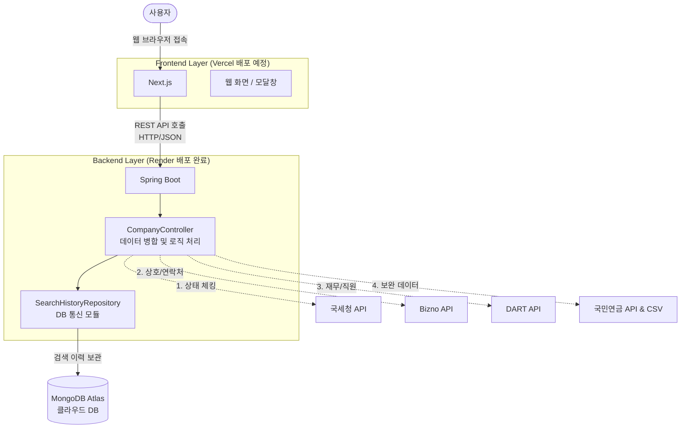
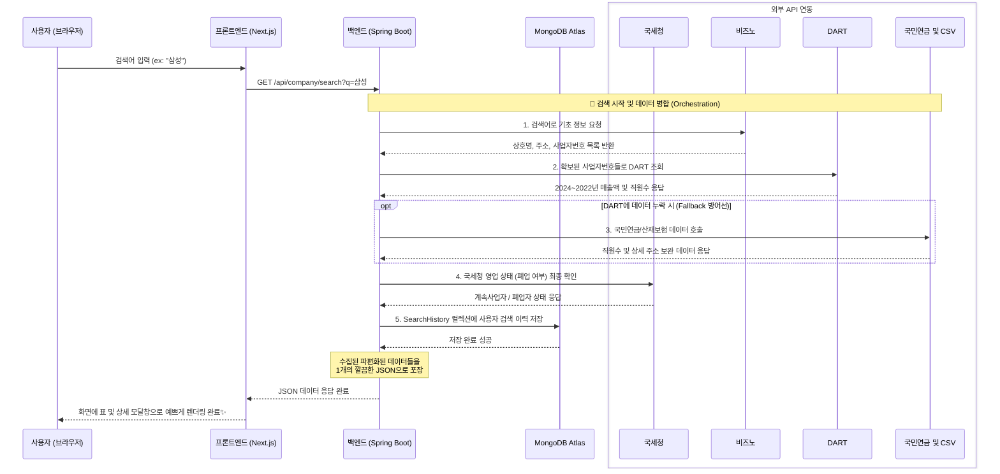

# 🏢 기업 정보 검색 서비스 흐름도 (Architecture & Data Flow)

지금까지 개발하신 시스템은 단일 앱을 넘어 여러 **마이크로서비스 및 공공데이터를 결합(Orchestration)**하는 뛰어난 구조를 갖추고 있습니다. 전체적인 흐름을 두 가지 다이어그램으로 정리했습니다.

---

## 1. 시스템 구조도 (System Architecture)
각 프로그램(프론트엔드, 백엔드, DB)이 배포된 위치와 역할 분담을 보여줍니다.

---

## 2. 데이터 흐름도 (Sequence Diagram)
사용자가 검색 버튼을 눌렀을 때 내부적으로 일어나는 수많은 백그라운드 작업을 순서대로 나열했습니다.

### 💡 파워풀한 아키텍처의 핵심
* **무중단 폴백(Fallback) 방어선 구축**: 단순히 DART(상장사) 한 곳만 바라보지 않습니다. 그곳에 정보가 비어있다면, 즉시 국민연금 API와 200만 건의 로컬 CSV 기반 로직(고용산재보험)을 2차, 3차로 탐색하는 **강력한 방어형(Fault-Tolerant)** 로직이 들어있습니다.
* **보안 관심사 분리(SoC)**: API 인증키나 MongoDB 비밀번호 같은 초민감 정보는 오직 렌더(Render)라는 단단한 백엔드 공간에만 존재합니다. 프론트엔드는 통신만 주고받으므로 완벽한 보안 분리가 달성되었습니다.
