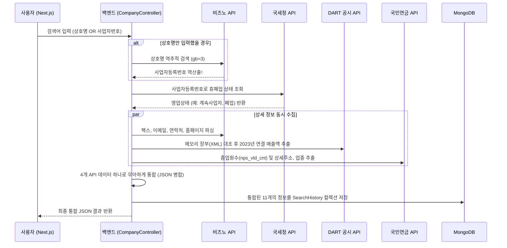

# 🏢 기업 정보 통합 검색 시스템 (V1) 아키텍처 요약

본 문서는 Spring Boot 백엔드와 Next.js 프론트엔드를 기반으로 구현된 **기업 정보 통합 검색 시스템**의 현재 구현 상태와 데이터 파이프라인 흐름을 요약한 문서입니다. 오늘 하루 동안 엄청난 발전이 있었습니다!

---

## 🌟 시스템 핵심 플로우 (Mermaid)

---

## 🛠️ 백엔드 (Spring Boot) 주요 구현 사항

### 1. 외부 API 분리 및 보안 설정 (`application.properties`)
> [!IMPORTANT]
> 깃허브 등 외부로 API 키가 유출되는 것을 막기 위해 모든 비밀키는 외부 환경 변수로 완전히 분리되었습니다.
> 모든 주요 키는 `@Value` 어노테이션을 통해 스프링 컨테이너가 안전하게 주입하며, 파일 자체는 `.gitignore`로 보호됩니다.

### 2. DART 고유번호 메모리 장부 최적화
서버가 켜지는 시점에 `@EventListener(ApplicationReadyEvent.class)`를 사용해 국세청 산하 DART 공시 시스템의 약 10만 건 기업 고유번호 XML 파일을 한 번만 메모리(`ConcurrentHashMap`)에 적재합니다. 이를 통해 매 검색마다 파일을 받느라 생기는 로딩 지연을 완벽히 잡았습니다.

### 3. 멀티 API 오케스트레이션 (데이터 보완 로직)
네트워크 오류나 무료 API의 한계를 극복하기 위해 다중 크로스체크 로직을 적용했습니다.
* **주소 정보**: 기본적으론 Bizno에서 찾지만, **국민연금 API**에 주소가 존재하면 국민연금 발급 도로명 주소가 가장 정확하므로 그것으로 덮어씌웁니다.
* **업종 정보**: Bizno의 `biz_type`과 NPS의 `bzic_nm` 중 존재하는 것을 유연하게 빼옵니다.
* **비즈노 Fallback 방어코드**: 메인 API 도메인 장애 발생 시, `api.bizno.or.kr`로 자동 우회 접속하여 시스템 다운을 방지합니다.
* **홈페이지 생존 유효성 검사**: 등록된 홈페이지 주소로 보이지 않는 `HTTP HEAD` 요청을 쏴서 실제로 접속되는 사이트인지 검증 후 출력합니다.

---

## 💾 데이터베이스 (MongoDB `SearchHistory`)

다음과 같이 총 11개의 필드로 DB 문서(Document) 구조가 정립되었습니다.

| 필드명 | 설명 | 주력 데이터 출처 |
|---|---|---|
| `bizNumber` | 사업자등록번호 | 프론트엔드 입력 OR Bizno 역추적 |
| `companyName` | 상호명 / 법인명 | Bizno |
| `status` | 영업상태 | 국세청 사업자 상태조회 |
| `address` | 핵심/상세주소 | 국민연금 (최우선) / Bizno (차선) |
| `industry` | 업종 (업태) | 국민연금 (최우선) / Bizno (차선) |
| `phone` | 연락처 | Bizno |
| `fax` | 팩스번호 | Bizno |
| `email` | 대표 이메일 | Bizno |
| `homepage` | 접속 가능한 웹사이트 | Bizno |
| `revenue` | 최근 1년 매출액 | DART 오픈 API |
| `employeeCount` | 직원수 | 국민연금공단 API |

---

## 🖥️ 프론트엔드 (Next.js) UI

> [!TIP]
> 정보량이 폭증할 때 사용자가 겪는 피로도를 줄이기 위해 UI 레이아웃을 논리적으로 분리했습니다.

1. **상호명 자동 매핑 UI 지원**: 사업자번호를 몰라도 '회사 이름'만 적어 검색하면, 백엔드가 가져온 진짜 `사업자등록번호(formatted_bno)`를 화면에 채워 넣고 "(자동확인)" 뱃지를 달아줍니다.
2. **모달(Modal) 데이터 구역화**: 필수 요약 정보(상태, 회사명) 아래에 얇은 가이드라인(`border-t`)을 긋고, **"상세 확인 정보"** 라는 이름으로 파생 데이터를 하나로 묶어 깔끔한 대시보드 뷰를 제공합니다.

---

## 🚀 향후 과제 (Next Steps)
1. **DART 영문 상호명 매핑 이슈**: 네이버(NAVER) 등 영문명으로 DART에 등록된 기업이 누락되지 않도록 별도 영문/한글 치환 사전 맵핑 시스템을 고안해야 합니다.
2. **검색 캐싱 시스템 도입 고려**: 이미 오늘 누군가가 검색해 DB에 저장해둔 사업자라면 4개의 외부 API를 재호출하지 않고 우리 DB(`SearchHistory`)에 있는 정보를 즉시 꺼내주는 캐싱 기능을 붙이면 조회 속도가 비약적으로 향상됩니다.
